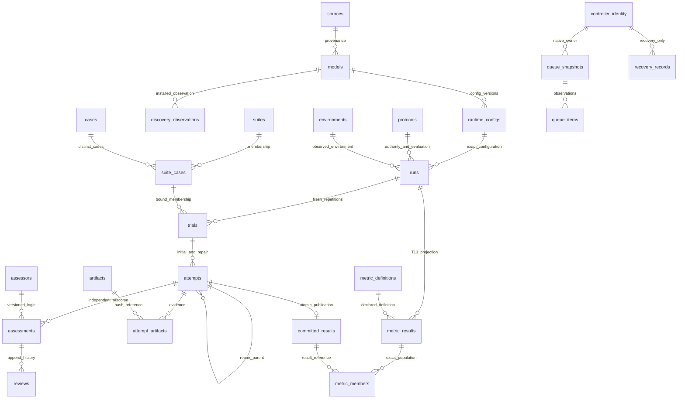

# Benchmark Database v2 — dictionary and ownership v1

Current schema **10** preserves the Stage A schema5 foundation and original immutable migrations `001_entities.sql`, `002_constraints.sql`, `003_execution_observations.sql`, `004_storage_types.sql` and `005_review_integrity.sql`. This is a storage format inside the existing `localbench` package, with opt-in native publication; native CLI/Tk defaults remain unactivated by B. No entity is an execution command. All entity IDs are explicit immutable row/version identities; names and tags are display metadata, not mutable identity keys. All tables reject UPDATE/DELETE after migration 2. The `attempt_execution_state` view derives current execution state from append-only lifecycle observations, falling back to the original imported attempt snapshot. Migration 3 allows a scheduled identity to finalize without rewriting it and prevents terminal execution observations from restarting. Migration 4 adds numeric/hash storage-type guards and an existing-row audit. Migration 5 closes the reviewed replacement and null-parent bypasses, audits existing lineage/PASS evidence/numeric rows atomically, and uses a portable nonfinite check after Windows SQLite 3.40.1 exposed a decimal-limit parsing difference. Supported connections enable and verify recursive triggers; insert-conflict guards protect every primary and nonredundant alternate UNIQUE identity (including the partial one-active queue index), even with recursive triggers disabled by a raw caller. Repair parents require a non-null index and exact same-trial immediate predecessor. No original migration checksum is changed. A changed identity, review, discovery state or recovery observation creates a new row with provenance, never overwrites history.

## Common fields and relationships

`id`: non-null text primary key unless the table declares a composite key. `source_id`: foreign key to an exact source snapshot. `version`: the producer/definition version, independent of the SQLite schema version. `*_json`: valid JSON retaining the original sealed envelope or declared payload, not a replacement scoring contract. Unknown source fields must remain in raw external evidence and `unknown_fields_json`; unknown identities are not invented. Hashes are lowercase SHA-256, never a guessed model tag digest. All foreign keys restrict deletion; there is no cascading loss of evidence. Row creation time is not an inferred execution time.

| Entity | Fields / units | Keys and references | Intended writer |
|---|---|---|---|
| `schema_migrations` | version (integer), name, SQL text SHA-256, applied_at | version PK; checked against bundled immutable contiguous chain and `user_version` | Migration runner only |
| `sources` | kind, format_version (nullable), location, byte SHA-256, captured_at, producer_version, metadata_json | id PK; unique kind/location/hash | Trusted import/storage publisher |
| `import_mappings` | version, implementation_sha256, definition_json | id PK; source FK; ID names a specific mapping version | Import definition registry |
| `import_records` | source_pointer, target_kind/id, status (planned/imported/excluded/unavailable), unknown_fields_json | id PK; source/mapping FKs; unique source/mapping/pointer | Future verified importer; no bulk import in A |
| `import_exceptions` | reason, detail_json | id PK; import FK | Importer audit only |
| `models` | version, full identity_json, canonical identity_sha256 | id PK; source FK; unique full content hash | Existing identity producer through `record_identity` |
| `discovery_observations` | observed_at, installation, tag, present/absent/unavailable, observation_json | id PK; source FK; nullable model FK | Existing discovery consumer; never deletes benchmark identity |
| `runtime_configs` | version, full config_json/config_sha256 | id PK; model/source FKs; unique model/hash | Existing configuration resolver through `record_identity`; no tag-based merge |
| `suites` | name, version, definition_json | id PK; source FK; name/version/source unique | Existing released pack/packet registry |
| `cases` | logical_id, version, input_sha256, definition_json | id PK; source FK; logical/version/source unique | Existing pack/packet case registry |
| `suite_cases` | position (1-based) | suite/case composite PK and FKs; position unique per suite | Suite registry; membership is distinct cases |
| `protocols` | name/version, track, role, worker_mode (ISOLATED/CUMULATIVE/null), definition_json | id PK; source FK; name/version/source unique | Existing evaluation/authority contract registry |
| `protocol_evidence_requirements` | purpose, minimum_count (positive files) | protocol/purpose composite PK and protocol FK | Protocol registry; declaration required before PASS publication |
| `environments` | version, facts_json, captured_at | id PK; source FK | Existing observed host/runtime producer |
| `runs` | created_at, origin (controlled/historical_observation/synthetic_test), manifest_json | suite/protocol/config/environment/source FKs; id/suite unique binding | Existing runner manifest publisher, later B integration |
| `trials` | ordinal (fresh trial), planned_trials, repeat_group | run/suite composite FK; suite/case membership FK; unique run/case/ordinal | Existing repetition planner; this table starts no trials |
| `attempts` | attempt_index, parent_id/index, execution_status, exit_code, started_at/finished_at, observations_json | trial/source FKs; unique trial/index; parent FK is same trial and exactly prior index | Existing case execution owner; repair requires a failed parent assessment |
| `lifecycle_events` | sequence, occurred_at, stage, detail_json | attempt/source FKs; unique attempt/sequence | Existing owner through future B publication transactions |
| `artifacts` | canonical relative_path, file-byte sha256/count, media_type, integrity (verified/missing/unverifiable/corrupt), verified_at | id PK; source FK; path unique; verified requires hash/size/time | Existing evidence publisher; raw files remain external |
| `attempt_artifacts` | purpose, required (0/1) | attempt/artifact/purpose PK and FKs | Existing evidence publisher |
| `assessors` | name/version, implementation_sha256, definition_json | id PK; source FK; name/version/hash unique | Existing assessor registry |
| `assessments` | outcome, nullable score/max, acceptance_checks/check_unit, implementation_truth, candidate_decision, detail_json | attempt/assessor/protocol/source/artifact FKs; id/attempt unique binding | Existing assessor only; process exit code never decides verdict |
| `reviews` | kind (technical/human/reference), status, reviewer, identity_verified, recorded_at, binding_json | assessment/source/artifact FKs; supersedes same assessment/kind review | Existing technical/human review writer; declaration is not authentication or execution permission |
| `committed_results` | outcome, committed_at | one per attempt; exact assessment/attempt composite FK; source and snapshot artifact FKs | Future B publisher, transaction boundary; no live wiring in A |
| `metric_definitions` | name/version, kind, definition_json | id PK; source FK; name/version/source unique | T13 catalog remains definition owner |
| `role_criteria` | role, version, criteria_json | metric/source FKs | T13 catalog, not a role assignment system |
| `metric_results` | projection_version, status, nullable numerator/denominator/percentage, population_json | run/config/metric/source FKs; config must match run | Existing T13 projection only; case-count units and exclusions retained |
| `metric_members` | disposition | metric_result/result PK; exact case/run/result binding | T13 projection provenance, never independent case scoring |
| `comparison_decisions` | policy_version, eligible (0/1), reasons_json | two metric result/source FKs; eligible requires same metric/projection/suite/protocol/population | T13 comparator; stronger evidence eligibility remains its responsibility |
| `telemetry` | version, observed_at, measurements_json, availability | attempt/source FKs; optional artifact FK | Existing resource observer; absent sensors remain unavailable |
| `publication_records` | dataset_version, sanitizer_version, approved_by/at, manifest_json | source/public artifact/approval artifact FKs; optional prior publication | Future explicit sanitized dataset approval; not an export service in A |
| `controller_identity` | singleton=1, fixed existing-controller name | singleton PK; source FK | Existing queue/process owner only |
| `queue_snapshots` | version, captured_at, state, state_json | controller/source FKs | Existing controller only; JSON snapshot preserves unknown native details |
| `queue_items` | item_id, position, state, observations_json | snapshot/item PK; config/run optional FKs; one Running per snapshot; run/config binding | Existing controller; not a second mutable queue |
| `recovery_records` | observed_at, disposition, detail_json | controller/source FKs; optional run/attempt/queue snapshot FKs; run/attempt binding | Existing controller recovery observer; never auto-reruns |

The schema distinguishes suite membership, fresh repetitions and linked repair attempts. An acceptance-check count has its own explicit unit and is never a case denominator. A Tester can earn PASS while its candidate decision is FAIL on defective implementation. Ordinary blocked execution cannot earn a PASS/FAIL assessment. Planner semantic BLOCKED-on-missing-goal criteria belong to T13's declared role criterion, not a rewritten execution verdict. Null scores stay null. Historical screens remain observations. First-pass and final repaired performance are separate attempt populations. Role suitability percentages are prohibited; no universal score or role auto-assignment table exists.

## Relationships

## Indexes and transaction boundaries

PK/UNIQUE indexes cover identity replay, version keys, membership order, run/case/trial identity, attempt order, source/mapping/pointer, artifact path and one committed result per attempt. Explicit indexes cover trial lookup, assessor history, lifecycle sequence, review history, artifact digest, discovery by installation/tag/time, import source/mapping, metrics by run/definition/config, telemetry by attempt/time and recovery by run/attempt. A partial unique index permits at most one Running queue item in a snapshot. All source entities and join records are append-only.

`transaction()` uses BEGIN IMMEDIATE, rejects nested transactions, commits once and rolls back on any error. `migrate()` uses this same boundary for the complete pending migration batch, including DDL, ledger and application/user version. No executescript implicit commit is used. Unknown application/newer versions and altered/gapped migration chains fail closed. SQL files ship in the Python package; source and installed-package paths are tested. Administrative tampering with the SQLite file is outside relational authorization: trusted local filesystem access can change pragmas or DDL and must be controlled by Windows ACLs.

## Read/write ownership and future authorization

Stage A connects only to isolated test/scratch databases. No current runtime imports this module. During a later B integration, existing producers retain execution/state ownership and use a small storage publisher in the same application. Reads can consume committed rows; writes are issued by the relevant native owner in explicit transactions. Filesystem storage cannot authenticate a remote human. Stage C must put server-side authorization between all read/control APIs and the owners: local admin and authenticated remote Owner may authorize execution; private viewers and public visitors have read scope only. Technical/reference approval cannot grant execution. Raw JSON must never be interpreted as commands.

Queue snapshots and recovery records are append-only observations of the native controller, not a dispatch interface, claim protocol, worker-control layer or scheduler. A singleton metadata row prevents a second declared controller; actual native instance lock and process custody remain the enforcement mechanism. One scheduler does not imply one database connection. No competing settings source is introduced: current native configuration continues to supply exact config snapshots.

## Provenance and integrity policy

Every source snapshot records original identity/version/location/hash and capture time. Complete bytes remain private external evidence where appropriate. `record_identity` reuses existing `v2.contracts.canonical_json_bytes`; it rejects a differing replay and does not parse tag names to manufacture missing facts. Different exact settings create different config rows. A unique content key may reject a duplicate alias, but never silently merges records with a different payload. Callers must retain sealed producer references and raw unknown fields, and record the producer version separately from DB format.

Artifact paths are relative to a trusted private artifact root. Verified artifacts declare file-byte hash, size and verification time; missing/unverifiable/corrupt references may have unknown hash/size and never qualify required evidence. Publication constraints require a verified snapshot, matching assessment/attempt and completed execution for PASS. Each protocol must declare required evidence purposes/minimum populations and each must have sufficient verified linked artifacts before success can commit. The database does not read artifact bytes or authenticate assessor meaning in SQL; B must finalize/hash/check existing evidence before insertion and reconcile after restart. Backup/restore independently rehashes every verified file and rejects stale declarations. No checksum proves authenticity or semantic correctness.

Comparisons require the same definition/projection/suite/protocol/population and keep configs separate; T13 still owns stronger per-case hash/review/exclusion checks. `population_json` must be the canonical T13 comparison population, preserving source/rubric/input/reference identities. The database never derives eligibility from a process exit code. Public records require hashed dataset and approval artifacts plus independent dataset/sanitizer versions; their presence cannot confer execution authority. Actual sanitization/authentication/export is future work.

## Stage B correction — schema10 append-only publication revisions
Migrations1-9 are unchanged. Additive migration10 introduces:
- case_publication_revisions: immutable ID and per-attempt contiguous revision; stage capture/assessed; exact verified snapshot FK, original final result FK only for assessed, row JSON/hash and artifact descriptor list. Capture cannot contain fabricated assessed_outcome/score/maximum_score. One capture and one final assessed publication per canonical attempt; inserts/replacements cannot rewrite either identity.
- case_publication_events: one global contiguous cursor and stable revision/event ID. Includes pending capture visibility before assessment as well as final assessed updates.
- case_publication_receipts: append-only per-event consumer acknowledgments for at-least-once delivery.

Upgrade preserves original final event sequences/IDs, result/projection rows and receipts. The native execution-completed boundary writes its capture publication atomically inside the authoritative existing DB; later native assessment appends provenance and an assessed revision without rewriting capture/history or inflating populations. Current projection chooses the latest revision per attempt; no new execution/scoring/control owner. Snapshot contract v2 distinguishes event revisions from published_attempts/final committed_results. Existing seven B entities and original A entities remain unchanged.

The final producer contract is [NATIVE_PRODUCER_CONTRACT.md](NATIVE_PRODUCER_CONTRACT.md), not the original committed-only description. Snapshot v2 includes pending captures and latest assessed revision per attempt; global case_publication_events carry optional result_id. History/compatibility rows and all prior checksum migrations remain unchanged. Source/runtime/CI/recovery evidence is [STAGE_B_HANDOFF.md](STAGE_B_HANDOFF.md). Schema10 contains45 tables (original35 + seven earlier B entities + three publication revision entities).
