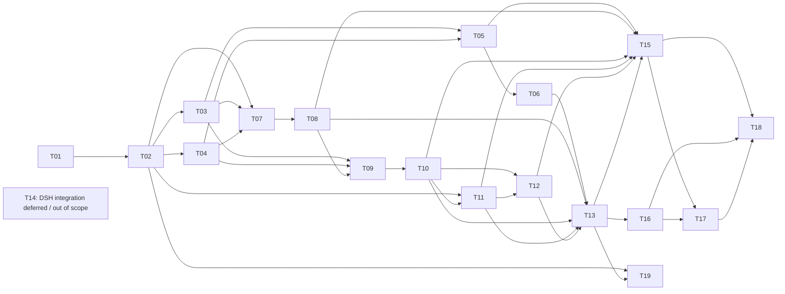

# Controlled Role Qualification v2 — Audited Task Backlog

**Status:** T01–T12 implementation and the delegated AI technical review of T05–T12 are complete within the authored/synthetic benchmark scope. The audit reviewed 80 case/task units and all 134 controls, corrected 40 case records and 120 controls, and approved the revised materials for benchmark use. This is not independent human certification, model qualification or Owner execution authority. Real isolated Worker seeds remain BLOCKED; real Worker artifact compatibility remains PROVISIONAL; untrusted Worker/Tester Python needs a separately authorized isolated environment. T13 reporting is COMPLETE with all material conditions and the four-configuration Windows/Linux CI matrix verified; T14 native DSH integration is DEFERRED / OUT OF SCOPE; T15 standalone deterministic regressions and T16 Results phases R0–R4 are COMPLETE: 97 targeted GUI tests and 552 full regressions passed in all four supported CI configurations; T17–T18 remain NOT STARTED; T19 expansion remains optional and NOT STARTED. **Updated:** 2026-10-09; see [versioned technical audit](technical-audit-20261009/AUDIT_REPORT.md), [case decisions](technical-audit-20261009/CASE_CONTROL_DECISIONS.md), its integration/validation completion record, and [T13 acceptance](T13_ACCEPTANCE_20261009.md).
**Authoritative implementation backlog:** This file supersedes the earlier chat-only task outline. Original T01–T19 IDs and completed T01–T13 records are preserved. The 2026-10-09 architecture correction below supersedes the original T14–T19 dependencies: Benchmark Lab is a standalone application, separate from the operational DSH Lab. Progress now records T05–T06 implementation as well as the user's approval to use A001/A002 as **benchmark reference designs**. T19 is an independent, nonblocking capability-test expansion item. The earlier Results revision updated tasks and acceptance criteria only. T05–T06 added the independent Planner adapter. T07–T08 add controlled Governor cases, semantic review, calibration records and narrow writer projections; no Results tab, actual model test or production authority is claimed.

## Key audit decisions (binding to the proposed implementation)

1. **Do not rebuild what already works.** Existing 23-case historical role battery, Assistant-001/002 fixed six-task Worker campaigns, 79/96 cumulative acceptance checks (not independent case counts), original role prompts, V2 Ollama execution/assessor/review writer, and mixed-benchmark GUI remain baselines. Keep frozen v1 packets unchanged.
2. **Two evaluation tracks; three Worker-relevant modes.** CONTROLLED_ROLE_QUALIFICATION tests each role against separately reviewed input. Its Worker assessments include ISOLATED_TASK (identical verified preconditions) and CUMULATIVE_PROJECT (identical initial intent/plan but each model's own predecessor code). The previously specified NATIVE_PIPELINE_INTEGRATION track remains historical/future research, outside this standalone release; it is not a prerequisite for controlled role or sequential Worker qualification.
3. **Blind Planner means truly blind.** The current project Planner probe exposes TASKS.md in the DOCS prompt AND again in its copied workspace. Neither visible path, metadata nor tool access may leak the fixed plan or assessor oracle into the new independent Planner mode. Keep old scaffolded probes labeled separately.
4. **Governor compares, but cannot authorize by prose.** Freeze substantive approvals/denials/escalations against exact canonical governance snapshots and explicit simulation assumptions. Governor candidate outputs are evaluation evidence, not permits. Actual owner-origin release and deterministic scope enforcement remain separate. Canonical governance bytes must not enter the public repository.
5. **Same reference plan is necessary but not sufficient for comparable Worker outcomes.** Independent per-task qualification needs identical starting code; end-to-end Worker continuation intentionally varies by candidate. Never insert the gold solution after a failed model task to pretend that the same candidate completed the project.
6. **Benchmark Lab does not operate the DSH Lab.** Native DSH installation, release receipts, role orchestration and operational availability are out of scope. T14 preserves the prior research as deferred future work, not completed integration. Existing Benchmark Lab runners, role interfaces, assessors and evidence paths own standalone qualification. Any additional role-handoff validation belongs to those existing paths; no duplicate engine or controller.
7. **Preserve role and review truthfulness.** No exact-phrase plan matcher, no implied pass from CLI exit 0, no automatic promotion/role assignment, no assumption that generated Python is OS-sandboxed. Report evidence gaps, wrong authority and wrong transport distinctly.
8. **Source/provenance boundary.** Public repo stores test case metadata, references and hashes. Private Governor and DSH sources and owner credentials are never copied into it; case-specific canonical governance snapshots belong in access-controlled run evidence.
9. **Results are traceable measurements, not decorative leaderboards.** The existing `queue_gui` owns the Tk interface; the existing runners and `flashnext_review` JSON/CSV/XLSX writer own execution and evidence. Add a chart-focused **Results tab in this GUI**, consuming the existing report files. Every capability bar/matrix decision must trace to versioned case membership, rubric, a real numerator/denominator and exact evidence. No new dashboard application, database, API server, run controller or scoring store.
10. **Evidence coverage is not intelligence coverage.** Shared L0/L1/L2 and the historical five-role suite offer useful reasoning, coding-diagnosis, instruction, evidence and bounded-tool cases; A001/A002 are real-project implementation tasks. The present inventory has **no validated vision or long-context-recall battery** and no general open-ended tool-selector qualification. Render `Not tested` without a score until versioned calibrated cases exist. T19 may add them later but must never block a useful initial Results tab.
11. **Reference-plan acceptance is limited.** The owner approved ASSISTANT-001 and ASSISTANT-002 as worthwhile benchmark references. Do not interpret this as approval of any generated code, unrestricted host execution, forged Governor grant, production integration, model promotion, or bypass of T09's approved Worker authorization record.

**Review identity clarification:** The 2026-10-09 delegated technical audit is the current case/reference suitability decision. Earlier serialized HUMAN_REVIEW_PENDING / OWNER_REVIEW_PENDING fields retain their original certification/authority meaning; they do not erase this separate AI technical review or grant execution. Future live responses still require substantive adjudication. That earlier technical audit included no T13/T16/T19 work; T13 reporting progress is recorded below.

**Definition of complete:** Each task needs its described acceptance evidence, not a model's self-report. Implementation code must pass its relevant regressions and support human review. Real-model tests are T17, not implied by earlier deterministic CI.

## Updated scope and dependency overview

| ID | Revised work item | Priority / size | Prerequisites | Status |
|---|---|---|---|---|
| T01 | Source audit and baseline evidence | P0 · Completed | — | COMPLETE |
| T02 | Freeze evaluation-mode, authority and disclosure contracts | P0 · Medium | T01 | COMPLETE — specification, validator and CI |
| T03 | Derive ASSISTANT-001 reference plan from existing tasks | P0 · Small | T02 | DESIGN ACCEPTED — AI technical reference review complete; execution release separate |
| T04 | Derive ASSISTANT-002 reference plan from existing tasks | P0 · Small | T02 | DESIGN ACCEPTED — AI technical reference review complete; execution release separate |
| T05 | Make project Planner qualification genuinely independent | P0 · Medium | T03, T04 | APPROVED_FOR_BENCHMARK — blind disclosure and fresh-session isolation verified |
| T06 | Build semantic Planner equivalence assessment | P0 · Medium | T05 | APPROVED_FOR_BENCHMARK — ten controls substantively reviewed; eight corrected |
| T07 | Create frozen project Governor decisions and authority conditions | P0 · Large | T02, T03, T04 | APPROVED_FOR_BENCHMARK — all 28 synthetic rulings reviewed against matching canonical bytes |
| T08 | Evaluate Governor rulings and constraint extraction independently | P0 · Medium | T07 | APPROVED_FOR_BENCHMARK — all 16 controls reviewed; four corrected; advisory only |
| T09 | Build canonical reference Worker handoffs with separate authority | P0 · Medium | T03, T04, T08 | APPROVED_FOR_BENCHMARK — both bundles/all 12 task slots technically reviewed; no execution authority |
| T10 | Add isolated Worker task qualification alongside existing project chains | P0 · Large | T09 | IMPLEMENTED/VERIFIED — cumulative identity and isolation checked; real isolated seeds BLOCKED |
| T11 | Extend Tester qualification with controlled implementation fixtures | P1 · Medium | T02, T10 | APPROVED_FOR_BENCHMARK — 16 authored cases/48 controls reviewed; real-artifact compatibility PROVISIONAL, untrusted execution BLOCKED |
| T12 | Extend Reviewer qualification with evidence-grounded cases | P1 · Medium | T10, T11 | APPROVED_FOR_BENCHMARK — 20 authored cases/60 controls reviewed and corrected; real-artifact compatibility PROVISIONAL |
| T13 | Define traceable capability/report metrics and extend existing writer | P0 · Large | T06, T08, T10, T11, T12 | COMPLETE — all reporting conditions; 524-test regressions and Windows/Linux Python 3.10/3.12 CI verified |
| T14 | Deferred native DSH integration research | Future / out of scope | None for this release | DEFERRED — not implemented or qualified |
| T15 | Standalone execution, evaluation and report regression validation | P0 · Large | T05, T08, T10, T11, T12, T13 | COMPLETE — standalone deterministic validation; 552 regressions and four-configuration CI |
| T16 | Complete existing GUI with chart-focused Results tab | P0 · Large | T13 | COMPLETE — R0–R4; 97 targeted GUI tests and four-configuration CI |
| T17 | Independently authorized standalone model benchmarks and Results validation | P0 · Medium | T15, T16 | NOT STARTED — no real model runs for this change |
| T18 | Standalone Benchmark Lab release with GUI, methodology and evidence exports | P1 · Small–medium | T15, T16, T17 | NOT STARTED |
| T19 | Expand capability cases for vision, long-context, reasoning and instruction following | P2 · Large | T02, T13 | NOT STARTED — existing-case/runtime inventory recorded; optional and nonblocking |

## Execution milestones and stop gates

| Milestone | Included tasks | Go/no-go evidence |
|---|---|---|
| M0 · Baseline | T01 | Source implementation map + prior CI and Git blob snapshot recorded; DSH provenance is historical, outside release scope |
| M1 · Ground truth and independent comparisons | T02–T08 | v2 mode/authority matrix; separate reference plans; blind Planner leakage tests; technically reviewed Governor case outcomes (AI review explicitly identified) |
| M2 · Canonical Worker and downstream roles | T09–T13 | reviewed reference Worker handoffs; independent-isolated vs cumulative Worker separation; Tester/Reviewer oracles; inherited evidence writer |
| M3 · Standalone regression proof | T15 | independent roles, authority boundaries, sequential Worker handoffs, failure propagation, report/CLI/GUI and frozen v1 regressions pass |
| M4 · Interface and genuine model results | T16–T18 | a chart-focused Results tab **in the same GUI**; measured case-level comparisons/evidence links verified against actual runs; released metric/rubric docs |
| M5 · Optional capability expansion (independent) | T19 | inventory existing case/runtime inputs; add reviewed and calibrated missing capability cases only when supported; **not a prerequisite** to first Results tab, T16/T17/T18 |

**Critical gate:** Qualification requires evidence from Benchmark Lab's own authorized harness and the exact tested model/runtime configuration. Process exit zero is not qualification. T16-R0–R4 depend on T13 reporting and their preceding phase tests, not T14, T15 or T19. T15 is a standalone release regression gate; real-model authorization, hardware and containment remain separate T17 gates. No operational DSH process or native release is required.

**Historical record rule:** T01–T13 task text below records the completed work and its original design assumptions. References there to future native integration are historical, not current dependencies or authority. Their accepted statuses and qualification limitations are unchanged.

## Detailed tasks

## Scope, authority contracts and project references

*T01–T04 · preserve the already-passing baseline; derive independently reviewed reference plans*

### T01 — Audit current benchmark and role handoff paths
**Status:** COMPLETE — source-audited · **Priority:** P0 · **Complexity:** Completed · **Dependencies:** None  
**Where:** local-model-bench: docs/qualification-v2/

**Reuse:** Both frozen project packets, historical role campaign, V2 assessment/review stack, mixed-queue GUI; separately sourced Governor and native DSH development pipeline.

**Bounded work:** Performed source audit and recorded the Git baseline and prior CI evidence. Windows-installed DSH/runtime/governance state remains deliberately unverified; it becomes an explicit prerequisite of T14.

**Acceptance:** The implementation map and baseline lock exist; the commit changes documentation only. No assertion of successful live-model or installed-DSH qualification.

**Change from the pre-audit list:** Completed; revealed Planner reference leakage in two places, advisory governance, direct-Ollama vs native DSH split and advanced DSH development pipeline.

### T02 — Freeze evaluation-mode, authority and disclosure contracts
**Status:** COMPLETE — specification and pure metadata guards verified in four CI configurations · **Priority:** P0 · **Complexity:** Medium · **Dependencies:** T01  
**Where:** local-model-bench: docs/qualification-v2/; additive contract and tests only

**Reuse:** T01 map, frozen v1 manifests/role packets, existing benchmark human-review semantics, Governor authority boundaries, DSH release design.

**Bounded work:** Define two top-level evaluation tracks: CONTROLLED_ROLE_QUALIFICATION (Planner, Governor, Worker, Tester, Reviewer independently) and NATIVE_PIPELINE_INTEGRATION (actual upstream outputs). Within Worker qualification distinguish ISOLATED_TASK (identical prevalidated prerequisite snapshot) from CUMULATIVE_PROJECT (same initial starter and plan, each model's real predecessor artifacts). Specify which input is candidate-visible versus assessor/owner-only; exact version/hashes, session/tool/sandbox scope, run/authority origins, human review, abort/block and failure attribution. Explicitly distinguish V2 direct-Ollama vs native DSH transport and require inspected installed-Dsh provenance before live native qualification. Define a protected-v1-file regression gate, not a blanket hash freeze on code that must be extended.

**Acceptance:** Published input/disclosure matrix and run-mode schemas distinguish these paths and fail closed on unknown modes. No model verdict grants owner authority, no integration result is labeled standalone role qualification, no human-oracle leak is authorized, and all v1 packets remain unchanged.

**Change from the pre-audit list:** Originally a generic track definition. Expanded to handle transport provenance, per-task vs chained-worker comparability, private governance and simulated vs real authority.

### T03 — Derive ASSISTANT-001 reference plan from existing tasks
**Status:** DESIGN ACCEPTED — AI technical reference review complete; execution release separate · **Priority:** P0 · **Complexity:** Small · **Dependencies:** T02
**Where:** project-benchmarks/assistant-001/qualification-v2/

**Reuse:** ASSISTANT-001/v1 PROJECT_INTENT, CONTRACT R01–R06, TASKS T01–T06 and existing independent acceptance tests.

**Bounded work:** Prepare a separate human-reviewed REFERENCE_PLAN and requirement/task traceability matrix from the already-frozen Worker sequence. Explain necessary ordering, allowed alternative decompositions, authorized file scopes, error cases, restart/expiry hazards and outcome-based acceptance. Retain exact v1 semantics; do not rewrite or mark the old TASKS as Planner-generated or Governor-approved.

**Acceptance:** 100% of R01–R06 material outcomes and critical invariants map to reference plan requirements; a reviewer can identify missing/unsafe steps. Reference is assessor-only for independent Planner and has its own content hash and review status.

**Change from the pre-audit list:** Reduced from writing a new plan to organizing and independently reviewing the plan already embodied in v1. Owner subsequently accepted use as a **benchmark reference**, not permission for unrestricted generated-code execution or actual Assistant deployment.

### T04 — Derive ASSISTANT-002 reference plan from existing tasks
**Status:** DESIGN ACCEPTED — AI technical reference review complete; execution release separate · **Priority:** P0 · **Complexity:** Small · **Dependencies:** T02
**Where:** project-benchmarks/assistant-002/qualification-v2/

**Reuse:** ASSISTANT-002/v1 PROJECT_INTENT, CONTRACT S01–S06, TASKS T01–T06, 96 checks, eight scenarios and pinned A001 dependency.

**Bounded work:** Prepare separately reviewed reference plan and S01–S06 traceability mapping. Capture virtual-time vs event-time, duplicate/dropped deliveries, checkpoint at-least-once semantics, authoritative expected observations, late/same-time behavior, CLI and journal-pair interoperability. No new project architecture or changed acceptance rules.

**Acceptance:** S01–S06 and all critical failure classes trace to reference plan deliverables; journal input dependency and seed provenance are explicit. The reference never appears in an independent Planner's input.

**Change from the pre-audit list:** Reduced from designing a new simulator plan to referencing the validated v1 contract and dependency. Owner subsequently accepted use as a **benchmark reference**, not a production simulator protocol or deployment approval.

## Independent Planner and Governor comparisons

*T05–T08 · prevent answer contamination, pin governance inputs and evaluate decisions*

### T05 — Make project Planner qualification genuinely independent
**Status:** APPROVED_FOR_BENCHMARK — blind disclosure and fresh-session isolation verified · **Priority:** P0 · **Complexity:** Medium · **Dependencies:** T03, T04
**Where:** local-model-bench: new qualification packet adapter/fixtures/tests, not v1 packet mutation

**Reuse:** role_prompt and task_prompt conventions, existing project starter source and project intent/contract.

**Bounded work:** Create an explicit Planner-visible allowlist and separate read-only starting-code view. Withhold TASKS.md, REFERENCE_PLAN.md, reference decisions, assessor code and reference implementations. Eliminate indirect leakage through workspace snapshots, copied README instructions, metadata, file names and any tool-readable directories. Preserve the existing scaffolded Planner probe as a distinctly labeled historical mode; do not silently change old trials. Planner may inspect genuine code stubs and released problem requirements, not a pre-solved plan.

**Acceptance:** Disclosure tests attempt prompt, workspace-file, tool-visible and metadata access and fail if the fixed task sequence/reference oracle is visible. Controlled Planner starts from identical task input and source snapshot across models. Existing scaffolded probe continues working as a separate mode.

**Change from the pre-audit list:** CRITICAL correction: T01 demonstrated TASKS.md was included both directly in DOCS and indirectly in the candidate workspace snapshot.

### T06 — Build semantic Planner equivalence assessment
**Status:** APPROVED_FOR_BENCHMARK — ten controls substantively reviewed; eight corrected · **Priority:** P0 · **Complexity:** Medium · **Dependencies:** T05
**Where:** local-model-bench: additive qualification rubric/assessor/review records

**Reuse:** v1 outcome-based acceptance criteria, six historical Planner intent cases and human-review writer.

**Bounded work:** Score material requirement coverage, feasible dependencies, atomic/bounded tasks, executable acceptance, scope restraint, risks, uncertainty management and required outputs. Compare to independently reviewed plan by objective rather than exact headings/task count. Calibrate with a valid differently decomposed plan, a critical omission, a scope-expanding plan and a correctly BLOCKED ambiguous plan; retain free-prose outputs and an auditable human verdict.

**Acceptance:** An alternate valid plan can pass; missing material behavior or forbidden operations cannot pass by matching labels. Judgment contains requirement-level evidence and severity; an automated similarity score alone never marks a Planner qualified.

**Change from the pre-audit list:** Existing historical Planner evaluation is manual and cannot serve as a project-specific equivalence oracle.

### T07 — Create frozen project Governor decisions and authority conditions
**Status:** APPROVED_FOR_BENCHMARK — all 28 synthetic rulings reviewed against matching canonical bytes · **Priority:** P0 · **Complexity:** Large · **Dependencies:** T02, T03, T04
**Where:** local-model-bench: project-specific v2 case metadata; private run evidence for canonical governance bytes

**Reuse:** Historical four Governor packets, source-backed LAW/STATE/GENERAL_INTENT loader and separate Governor authority corpus.

**Bounded work:** Build independent ASSISTANT-001/002 cases spanning valid approval, prohibited action, owner-only exception, missing approval/identity, conflicting Law versus Intent, unsafe external transfer, scope drift, fabricated prior approval and genuine uncertainty. Provide owner/human-reviewed expected APPROVE, DENY or ESCALATE outcomes and required rationale/constraints. Freeze scenario assumptions and exact canonical Law/State/General Intent bytes per comparison group: hash evidence and retain private contents outside the public repo. Do not assume unresolved owner identity or protected assignments have been resolved; conditional simulation permissions must be explicitly labeled as simulation.

**Acceptance:** Each scenario has stable ID, exact plan and governance snapshot provenance, reasoned expected decision/constraints and human review. A fake Owner approval fails; ambiguous real authority escalates; docs drift blocks a comparison instead of changing its ground truth.

**Change from the pre-audit list:** The existing project Governor probe accepts arbitrary plan/doc inputs, not a frozen project decision oracle; no simulation decision may be confused with production permission.

### T08 — Evaluate Governor rulings and constraint extraction independently
**Status:** APPROVED_FOR_BENCHMARK — all 16 controls reviewed; four corrected; advisory only · **Priority:** P0 · **Complexity:** Medium · **Dependencies:** T07
**Where:** local-model-bench: additive Governor assessment and review records

**Reuse:** Actual governor cases from historical role campaign; project run_probe and evidence writer.

**Bounded work:** Present frozen plans and matching governance snapshots identically to each candidate. Evaluate decision category, grounded reasons, required escalation, retained task-specific conditions, prohibited inferred authority and refusal to rewrite the plan. Count unsafe approval as critical independently of other successful cases; report erroneous denial and false escalation separately. Preserve full natural-language verdict for human review; never treat generated approval as an executable permission token.

**Acceptance:** Correct APPROVE/DENY/ESCALATE and material constraints are distinguishable from blanket deny or token matching; decision/justification and evidence hashes are reviewed. Controlled Worker input remains unchanged when candidate Governor gives the wrong answer.

**Change from the pre-audit list:** Current project Governor is advisory and does not supply an approved, independently validated handoff.

## Canonical Worker inputs and controlled downstream roles

*T09–T12 · distinguish identical task inputs from model-specific continuation artifacts*

### T09 — Build canonical reference Worker handoffs with separate authority
**Status:** APPROVED_FOR_BENCHMARK — both bundles/all 12 task slots technically reviewed; no execution authority · **Priority:** P0 · **Complexity:** Medium · **Dependencies:** T03, T04, T08
**Where:** project-benchmarks/assistant-001|002/qualification-v2/ + shared handoff assembler

**Reuse:** v1 project task scopes, same task prompts, canonical governance case constraints, historical Worker approved-plan examples.

**Bounded work:** For each T01–T06 project task, build versioned input bundle: project intent, immutable full reference plan, exact assigned task, scope/tools, relevant Governor restrictions, accepted exceptions if explicitly authorized, acceptance requirements, starting workspace identity and previous handoff slot. Identify origin of authority separately: a trusted operator-approved benchmark authorization or explicitly simulated scenario authority; never model-generated Governor prose. Record pending-human-approval until the reference bundle has been reviewed.

**Acceptance:** Task bundles and plan hash are identical for like-for-like model comparisons; reference version/authorization is traceable. No unapproved exception or Governor-candidate output enters canonical Worker intent. Human review is required before labeling a reference bundle approved.

**Change from the pre-audit list:** The current Worker receives fixed task+contract+predecessor, but lacks a separate explicitly approved plan/Governor guidance/authority record.

### T10 — Add isolated Worker task qualification alongside existing project chains
**Status:** IMPLEMENTED/VERIFIED — cumulative identity and isolation checked; real isolated seeds BLOCKED · **Priority:** P0 · **Complexity:** Large · **Dependencies:** T09
**Where:** local-model-bench: new controlled Worker mode/fixtures; reuse assistant001.campaign and assessment

**Reuse:** Working six-step cumulative chain, frozen starters, exact file-scope checks, current Worker's accepted predecessor gating and no-gold-continuation semantics.

**Bounded work:** Implement TWO separately reported Worker trial modes. ISOLATED_TASK: each model starts from the same independently prevalidated prerequisites/seed snapshot with the assigned task unsolved; seed excludes the target task's solution and is not injected as feedback after failure. CUMULATIVE_PROJECT: each model starts from the same raw starter and canonical six-task plan, then preserves its own real previous code, tests and handoffs; failures block successors without replacement. Hash the initial/seed/prior-code inputs, implement fresh-session and failure classifications, retain original v1 runner as historical comparison.

**Acceptance:** Isolated comparisons have identical input hashes across models for the same task; cumulative runs preserve model-produced predecessors and do not claim later workspaces remain byte-identical. A failed stage is not filled with assessor/reference code; v1 behavior and historical runs remain unchanged.

**Change from the pre-audit list:** A common plan does NOT imply common starting code for later sequential tasks. Both measurements are necessary to avoid unfairly attributing upstream implementation differences.

### T11 — Extend Tester qualification with controlled implementation fixtures
**Status:** APPROVED_FOR_BENCHMARK — 16 authored cases/48 controls reviewed; real-artifact compatibility PROVISIONAL, untrusted execution BLOCKED · **Priority:** P1 · **Complexity:** Medium · **Dependencies:** T02, T10
**Where:** local-model-bench: additive v2 Tester fixtures and evaluation; historical cases preserved

**Reuse:** Historical Tester cases A/C/D, reference-correct/defective fixtures, project Tester run_probe and captured independent acceptance.

**Bounded work:** Add known-good and single/multiple-known-defect candidates, shallow/false-green tests, broken test infrastructure, missing coverage, and actual Worker code snapshots from the two projects. Tester may run/repair tests within authorized file scope but must not edit implementation. Evaluate correctness of PASS/FAIL/BLOCKED plus usefulness/validity of new tests and evidence. Avoid automatically equating a bad Worker artifact with a bad Tester.

**Acceptance:** A correct FAIL on deliberately broken code is scored as successful Tester behavior. False PASS on a critical defect, unauthorized implementation changes or fabricated execution are failures. Environment failures remain BLOCKED/attributed, not model defect by default.

**Change from the pre-audit list:** Project Tester probe uses arbitrary Worker artifacts without frozen known-good/bad comparison; historical controlled cases already provide a reusable precedent.

### T12 — Extend Reviewer qualification with evidence-grounded cases
**Status:** APPROVED_FOR_BENCHMARK — 20 authored cases/60 controls reviewed and corrected; real-artifact compatibility PROVISIONAL · **Priority:** P1 · **Complexity:** Medium · **Dependencies:** T10, T11
**Where:** local-model-bench: additive Reviewer fixtures and rubric

**Reuse:** Historical six Reviewer contrast packets, DSH final Reviewer prompt, project Reviewer probe's existing code-hash matching metadata.

**Bounded work:** Create known accepted, defective, fabricated-claim, stale-code-hash, scope-drift, missing-test, contradictory-evidence, blocked-infrastructure and post-repair fixtures. Reviewer gets real code and bounded evidence, read-only; it may not assume Tester/Worker prose is proof. Evaluate PASS/FAIL/BLOCKED against a human-reviewed oracle, including explicit uncertainty when evidence is inadequate.

**Acceptance:** Reviewer catches contradictory/stale evidence, recognizes genuinely sufficient proof, does not edit artifacts or invent tests and correctly reports blocked evidence. Outputs remain advisory; no role assignment or action authority from first-line PASS.

**Change from the pre-audit list:** Current synthetic reviewer cases and project probes are useful but do not independently score complete Assistant project evidence across known truth conditions.

**Batch 5 implementation evidence (T11–T12):** [T11/T12 case inventory and boundaries](TESTER_REVIEWER_T11_T12.md) and [acceptance record](BATCH5_IMPLEMENTATION_RECORD.md). Windows/Linux Python 3.10/3.12 CI passed. Adds 36 independently assessable project cases and 108 authored annotation controls through the existing role harness, project assessors and writer. Correct Tester FAIL can receive role PASS; evidence and scope failures remain distinct. No real Worker bundles were available in the inspected inventories; all source origins remain explicit. Deterministic validation is not human substantive acceptance or model qualification.

## Evidence and standalone regressions

*T13–T15 · extend known tooling, do not build a second orchestrator*

### T13 — Define traceable capability/report metrics and extend existing writer
**Status:** COMPLETE — 16 defined metrics, 18 source projections, role criteria, sealed/legacy adapters and all deterministic acceptance conditions verified in four CI configurations · **Priority:** P0 · **Complexity:** Large · **Dependencies:** T06, T08, T10, T11, T12
**Where:** local-model-bench: `src/localbench/v2/flashnext_review.py`, existing V2 `reporting.py`, role/project run summaries, JSON/CSV/XLSX and additive v2 report contract/tests; **no new results backend or database**

**Reuse:** Existing review-package JSON, case-results CSV, role-summary CSV, XLSX, raw case/evaluator evidence, planned/observed trial aggregates, first-pass/repair flags, tool telemetry and preserved model/runtime provenance. [Source inventory](RESULTS_TAB_COVERAGE_INVENTORY.md) distinguishes actual available fields from desired new metrics. The GUI will **read** the writer's metric exports, not invent a second scorer.

**Bounded work:** Define a versioned **metric catalog** for (a) capability groups `reasoning`, `coding`, `vision`, `tool_use`, `instruction_following`, `long_context_recall`; (b) Planner/Governor/Worker/Tester/Reviewer suitability; (c) Assistant-specific `multi_step_tasks`, `tool_selection`, `error_recovery`, `permission_boundaries`, `evidence_accuracy`. Each metric definition must name its `metric_id`, definition/scoring rule, direction, source dataset, case membership (exact suite/case IDs, grouping/dedup key and exclusions), `suite_id/version`, `rubric_id/version`, deterministic-vs-human scoring authority, eligibility/comparison scope, evidence references and conditions for `Not tested`. Model identity includes exact tag/digest/quantization/runtime/transport/context/inference settings when observed; absent fields stay **unknown**.

**Separate run fields:** Record `execution_status` (started/completed/failed/blocked/not attempted), `assessment_outcome` (independently scored pass/fail or unknown), and `human_adjudication` (approved/rejected/pending/not required) **independently**, retaining raw legacy `status` and `correctness`. State taxonomy must distinguish **failed**, **blocked by prerequisite/authority**, **not attempted**, **not tested** (no defined/evaluated case for the category), **unsupported** (verified runtime/input incompatibility), and **pending review**. A test that legitimately identifies defective Worker code can be a successful **Tester** evaluation even though the code being tested fails. An isolated task blocked by earlier work must not be scored as an executed failure.

**Denominators and eligibility:** Emit for each category/source and configuration the count of **distinct eligible scored case IDs**, correct/earned-case **numerator and denominator**, separately the planned/attempted/blocked/not-attempted case counts, repetitions/attempt counts and cumulative **acceptance-check counts** (different measurement units). Only calculate a percentage when a declared rubric supplies assessed numerator and a **positive** case denominator. `0/5` is a valid 0%; `0/0`, missing legacy field, unsupported modality and pending-oracle score yield **null/Not tested/Unrated**, never 0% or automatic PASS. Report **first-pass** and **post-repair/final** results separately, without double-counting one case across repairs or fresh repetitions. Preserve exception/critical-violation annotations and unresolved human review. When a source supplies graded checks within a case, give that score its own check-level metric, never mislabel it as a unique-case count.

**Comparison eligibility:** Validate same named capability definition, suite and rubric versions, case population/input/reference hashes, evaluation track, role, Worker mode, scored unit and compatible runtime/input conditions. Intentionally varied **model configurations** remain separate labeled comparison series, not merged identities. Incompatible sources, different modalities, altered prompts, mismatched cases or unverified runtime/config fields must be **explained and excluded from combined scores**; underlying results remain viewable individually. Do not combine text-only coding diagnosis, end-to-end Worker projects and human role judgments as one universal percentage without reviewed membership/aggregation rules.

**Backward compatibility:** Extend the existing writer/CSV/XLSX and introduce additive versioned JSON fields/views or an explicit versioned read-only adapter. Read original `flashnext-role-review-package:v1`, V2 aggregate-report:v1 and Assistant summaries without overwriting them; preserve original workbook/case file paths and column meaning. For missing/legacy source fields, retain `null`/`unknown`/`review pending`, not fabricated default zeros. Do not write a separate metric result state store or rescore raw evidence silently.

**Acceptance:** (1) Every displayed metric has a published versioned definition, case membership, scoring authority, **numerator/denominator**, case IDs and exact evidence refs; (2) no aggregate score combines incompatible track/mode/rubric/input conditions; (3) unique cases vs repeated trials vs 79/96 cumulative checks remain different counts; (4) first-pass and repaired outcomes are separately traceable; (5) genuine zero, absence of test, unsupported input, downstream block, unattempted item and pending adjudication yield different states; (6) old reports load with unknowns and original review workbook links intact; (7) legacy Tester FAIL-on-bad-code counts as **Tester success** when the released Tester rubric says so. Deterministic normalization/CSV-JSON parity fixtures required before T16 rendering.

**Verified completion:** [Acceptance record](T13_ACCEPTANCE_20261009.md) maps every material condition and all 20 requested fixture scenarios to tests. Implementation `e1c41b6ceb55dbff7825066ff56a01b9f036329f` passed [Windows/Linux Python 3.10/3.12 CI](https://github.com/floydtrey/local-model-bench/actions/runs/37988938887): 48 targeted reporting tests and 524 full-suite tests per configuration, zero failures and only existing platform-specific skips. Real Tk runs on every configuration; the isolated discovery/teardown ownership correction resolves demonstrated hazards behind the earlier Windows crash. Frozen sources, queue functionality and historical writer paths remain verified. Vision/long-context stay Not tested; general tool selection/agent error recovery remain insufficient coverage. No model inference, Flash-Next changes, permanent installation changes or T14/T16/T19 work occurred.

**Change from the earlier backlog:** Reporting is now a **Results-tab metric contract**, not merely extra generic failure-attribution fields. The existing writer and V2 aggregate layer still own authoritative evidence/scoring; category bars/suitability are projections of reviewed case-level results, never self-assigned model intelligence ratings.

### T14 — Deferred native DSH integration research (out of scope)
**Status:** DEFERRED / OUT OF SCOPE — not implemented or qualified · **Priority:** Future proposal · **Dependencies:** None for standalone release
**Where:** Historical source audit and prior Git versions of this backlog; any future integration benchmark requires a separately approved scope.

**Preserved research:** T01's source audit found native release-bound Planner/Governor, Worker, Tester, Repair and Reviewer paths in a separate DSH development branch. Installed DSH provenance was not verified. The former T14 proposed installation reconciliation, a thin adapter and synthetic native release trials. That proposal is deferred, not completed or silently deleted.

**Current boundary:** Do not connect to, inspect the live pipeline of, modify or operate the operational DSH Lab for this project. Native installation, release receipts and operational role orchestration do not gate Benchmark Lab. Governor may read applicable canonical governance documents only as benchmark reference material; no operational authority follows.

**Acceptance of architecture correction:** T15–T18 have no dependency on this deferred item. If standalone sequential role/Worker handoffs need more validation, extend tests of the existing Benchmark Lab harness under T15. No new engine, service, state store or orchestration layer is authorized.

### T15 — Standalone benchmark regression validation
**Status:** COMPLETE — standalone deterministic validation passed locally and in all four supported CI configurations · **Priority:** P0 · **Complexity:** Large · **Dependencies:** T05, T08, T10, T11, T12, T13
**Where:** existing `local-model-bench` test suites/workflows only; report fixtures exercise the **existing** writer/reader and provenance boundaries.

**Reuse:** Prior Windows/Linux Python suites, existing standalone role/handoff tests, GUI fake runner and native PowerShell launch tests, historic role fixtures, A001/A002 assessor calibration, and new T13 versioned metric definitions.

**Bounded work:** Validate independent role qualification, controlled inputs and authority boundaries, sequential Worker handoffs, Tester/Reviewer evidence, failure propagation, runtime/tool compatibility, first-pass/repaired outcomes, reports and existing CLI/GUI behavior using Benchmark Lab alone. No external DSH process or native release is required. Preserve earlier regression targets (direct/indirect Planner answer leaks, changing governance, forged Governor grants, wrong plan/role, seed contamination, stale hashes, inherited bad code, no-gold continuation, false-green Tester/reviewer, unexecuted test commands, runtime mismatches, failed/interrupt/restore and authorized stop). Add deterministic **report fixture cases** for: executed PASS and FAIL, upstream BLOCKED, NOT_ATTEMPTED, NOT_TESTED category, UNSUPPORTED verified runtime/input, human PENDING_REVIEW, stale/missing legacy fields, genuine `0/n` versus no denominator, untested vision and long-context, first-pass failure repaired to success, an independently **correct Tester FAIL** on a defective implementation, repeat/cumulative-check inflation, contradictory evidence, and two suites/Worker modes/rubric versions that must remain incomparable. Validate JSON/CSV/XLSX normalized values and exact source evidence/case/attempt references; no live inference.

**Acceptance:** Deterministic fixtures produce **the expected status and denominator** at raw-case and grouped-result layers, correctly exclude incomparable records with explicit reasons, never turn missing fields into zero/pass or blocked successors into failed attempts, and keep Tester success distinct from the defective code outcome. All existing authority and v1 packet regressions remain passing; original output schema and review links remain usable. No new Results-tab metric can pass its test without the case IDs/evidence records needed for drilldown. Synthetic harness evidence must not be mistaken for real-model qualification.

**Change from the earlier backlog:** Expands the existing regression gate to catch false reporting and chart-denominator bugs alongside incremental T16 user-interface verification; T16 still owns **real Tk click-to-evidence** tests.

**Validation record:** [Standalone Results implementation and phase evidence](T16_RESULTS_IMPLEMENTATION.md), including [complete supported CI](https://github.com/floydtrey/local-model-bench/actions/runs/37996460544). Existing harness/report/CLI/GUI tests are reused; no model execution or DSH release is needed.

## GUI, real-model pilots and release

*T16–T18 · extend existing queue and existing review writer; a read-only Results slice can begin after T13 without starting a second app or waiting for T19*

### T16 — Complete the existing GUI and chart-focused Results tab
**Status:** COMPLETE — requested R0–R4 GUI scope verified locally and in all four supported CI configurations · **Priority:** P0 · **Complexity:** Large · **Dependencies:** T13
**Where:** `src/localbench/queue_gui/app.py`, existing queue state/controller, Tkinter widgets and project launchers; consume JSON/CSV/review writer outputs and run evidence **read-only**, with no second dashboard, back-end service, database, state store or orchestration.

**Reuse:** Existing Ollama-model selection, mixed benchmark queue, dynamic T01–T06 tasks, screen/qualification phases, live terminal, subprocess custody, pause/stop/emergency stop, atomic queue persistence/recovery and `Open review workbook`. Read stored legacy role/package/Assistant reports plus T13 normalized metric exports; report writer remains the source of authoritative scoring.

**Bounded implementation slices (linked, not renumbered tasks):**

- **T16-R0 — Read-only Results foundation (entry gate: accepted T13).** Add `Results` as another view/tab **inside the same Tkinter GUI**, not a new application. Discover/load existing stored `RUN_DIR` reports and original `review-package.json`/`case-results.csv`/`role-summary.csv`, V2 aggregate reports and Assistant summaries through a backwards-compatible read-only adapter. Show model config, source/run/suite, case list, observed statuses, review pending state and evidence links where known. Unsupported/missing fields remain unknown. Do not touch queue state or infer success from process exit. Complete this phase's tests before R1; subsequent phases likewise advance only after their tests pass.
- **T16-R1 — Charts and role matrix (requires T13-defined metrics and verified data).** Show **grouped horizontal bar charts by model configuration** for reasoning, coding, vision, tool use, instruction following and long-context recall; show numerator/denominator, **distinct case count alongside percent**, suite/rubric/source and review/eligibility legend, and visibly distinguish **first pass** vs **after repair**. Render `Not tested`/no score/**no bar** for categories without qualified cases; show `Unsupported` only from verified modality/interface limitation. Build a five-role suitability matrix (Planner/Governor/Worker/Tester/Reviewer) with supporting case counts/evidence and **versioned minimum coverage, essential safety gates, critical failure policy, human adjudication and criterion IDs**; until requirements are satisfied, status is **Provisional/Review pending/Insufficient evidence**, never automatically Qualified. No universal intelligence score or role assignment.
- **T16-R2 — Assistant-specific panels, filters and exact drilldown (requires T13).** Add distinct Assistant indicators for multi-step tasks, tool selection, error recovery, permission boundaries and evidence accuracy, each with a defined case population and measured basis; distinguish code that implements recovery from the *agent's* recovery ability. Filters for suite, role, evaluation track, Worker mode, exact model/configuration/runtime and human review status (with coverage and first-pass/final options). Selecting a horizontal bar, matrix cell or Assistant metric populates a **selected-result panel** showing measured outcome, numerator/denominator, contributing unique case IDs, failed and blocked/not-attempted cases, human review/provisional reason, exclusion/incompatibility reason and exact underlying raw evidence/run folder/workbook path; allow opening the selected case artifact. Chart selection must never open a similarly named case from a different suite, ordinal or code hash.
- **T16-R3 — Existing queue integration.** Connect Results selections to the existing saved queue item and exact run directory identities. Reuse queue persistence, recovery, workbook access and execution controls without changing execution or rebuilding persistence. Do not add native DSH routing. Results loading must not start inference, resume a queue or execute artifacts.
- **T16-R4 — Deterministic UI/interaction coverage.** Use actual Tk widgets plus fake runners/stored report fixtures (no model, no new browser/dashboard) for grouped-bar selection, role-matrix cell selection, filters, resizing/scrolling, missing legacy reports, untested vision, pending review, blocked downstream tasks, conflicting comparability keys, correct Tester FAIL on bad code, first-pass/repaired display and exact case/evidence navigation. Re-run old GUI/pause/stop/recovery and native PowerShell forwarding tests.

**Acceptance:** The Results tab renders supported historic/per-case/role evidence **without fabricating** capability percentages, absent data, universality or human approval. Every eligible bar is tied to a released T13 metric definition, distinct-case numerator/positive denominator and clickable exact-case/evidence references; `Not tested` shows no bar; case count appears alongside rate; Provisional suitability has role evidence and human review gate; filters never blend incomparable suites/tracks/configurations. Selecting a bar/matrix cell drills to its exact run, case IDs and actual evidence hash or reports unavailable honestly. Legacy reports and queue functions behave exactly as before; no second web app, backend, database, state store or orchestrator is created. CI exercises GUI/report fixtures without inference.

**Architecture correction:** T13 supplies the accepted reporting foundation for all R0–R4 phases. Native DSH integration and unrelated execution-harness development are not prerequisites. The first usable Results tab uses existing reports before any new model tests. Record the exact verified phase; unfinished GUI work must not be called full T16 completion. T19 is optional and nonblocking.

### T17 — Pilot real models and reconcile Results against actual run evidence
**Status:** NOT STARTED — no real model runs for this change · **Priority:** P0 · **Complexity:** Medium · **Dependencies:** T15, T16  
**Where:** User-authorized standalone Benchmark Lab host; disposable workloads; existing `local-state` run evidence and Results view only.

**Reuse:** Existing Screen/Qualification model queue, frozen role/project packets, independent assessments, Benchmark Lab execution authorization and Tester/Reviewer records, and T13/T16 read-only Reports/Results wiring.

**Bounded work:** Perform real two-configuration independent Planner/Governor screens against matching references and provenance, then one isolated Worker task, a full cumulative Worker chain, controlled Tester/Reviewer good/bad cases and standalone sequential Worker handoffs in the existing harness. Compare actual case-by-case raw model/tool/output/test evidence, normalized T13 JSON/CSV/XLSX rows, visible T16 grouped bars, suitability matrix and selected-result drilldown **by exact case ID, ordinal and assessed artifact hash**. Independently recompute each category numerator/denominator and status from source cases; verify every visible claim, filter and comparison eligibility/exclusion reason. Document absent runs, unreviewed cases, historical missing metadata and unavailable/unverified modalities as **Not tested/Unknown/Provisional**, not zero or PASS. Distinguish correct Tester FAIL from underlying code failure, blocked downstream from executed failure, first-pass from repaired and genuine model recovery from implementation replay correctness. Preserve raw evidence, time/performance and human intervention records; use disposable VM for untrusted code and model-specific operator-approved scope, hardware and containment.

**Acceptance:** Pilot case raw evidence, normalized writer artifacts and displayed Results agree for every sampled model/category/role/Assistant metric and exact evidence link; independently recomputed case numerator/denominator and count of repeats/acceptance checks match chart labels with no duplicate inflation. Incompatible model/runtime/track/Worker-mode versions are clearly excluded, and clicking the chart opens the exact supporting case. Real model tool use and standalone run provenance is verified separately; human adjudication is visibly provisional until reviewed and no role is automatically assigned. A missing capability battery remains Not tested, and a missing external run report never becomes zero. Regression suites continue passing.

**Change from the earlier backlog:** Beyond genuine model qualification, T17 now explicitly **validates the Results UI numerically and evidentially against real run records** rather than accepting a passing synthetic visualization.

### T18 — Standalone Benchmark Lab release
**Status:** NOT STARTED · **Priority:** P1 · **Complexity:** Small–medium · **Dependencies:** T15, T16, T17
**Where:** Existing `local-model-bench` docs, packet/metric/rubric manifests, CSV/JSON/XLSX output/release evidence and GUI usage guide.

**Reuse:** T01 baseline, two v1 manifests and approved benchmark-reference designs, T02 evaluation/authority contract, T13 released metric catalog and report writer, T16 Results tab, T17 actual model/evidence audit.

**Bounded work:** Release the standalone application, existing GUI, qualification methodology, case inventories, scoring rules and evidence exports. Actual DSH integration is not a release criterion. Freeze and document exact project/suite/case IDs, category membership and exclusions, `metric_id`/rubric/version/scoring source, first-pass versus final denominator policies, distinct cases vs repeated trials vs cumulative checks, role suitability **versioned criteria/minimum coverage/critical safety gates/human-review status**, model/runtime/transport/config comparability, not tested/unsupported/blocked/failed/not attempted/pending statuses, and how to inspect source evidence through the selected-result panel and original workbooks. Preserve canonical governance/owner release hashes without publishing private bytes. Publish a coverage map for **reasoning/coding/vision/tool use/instruction following/long-context recall** and five Assistant-specific dimensions, including clearly named unsupported/unmeasured areas and any T19 planned future tests. Preserve legacy schema read rules, chart limitations and original queue/CLI commands; no automatic model or component promotion.

**Acceptance:** A reader can reproduce every released model-category bar and role-suitability label from stated suite/rubric versions, exact included case IDs, numerator/denominator, review/adjudication state and source artifacts. Documentation distinguishes zero from unknown and missing metrics, explains exclusion of incompatible trials, historical report limitations and separate first-pass/repaired outcomes. Unsupported/untested capabilities are **explicitly unlabeled by score**; Reviewer/Planner/Governor preliminary findings remain Provisional pending human review. Existing benchmark packet/version integrity, GUI queue/workbook access and raw results stay intact. **T19 capability expansion is not required** to release a useful honest Results tab.

**Change from the earlier backlog:** Adds a **reproducible metric dictionary, user-visible Results limitations, coverage matrix, comparison policy and review criteria** to the v2 release gate.

## Optional capability-test expansion

*Optional future work T19; existing task IDs and completed work are preserved, with dependencies corrected above.*

### T19 — Separately expand unsupported or uncalibrated capability tests (nonblocking)
**Status:** NOT STARTED — initial existing-suite/runtime-input inventory documented, new cases and scoring not created · **Priority:** P2 · **Complexity:** Large · **Dependencies:** T02, T13  
**Where:** versioned existing `benchmark-packs/v2/` or reviewed new capability case packs, V2 runtime input adapters/evaluators/CI; T13 writer for score publication. **Not** a new dashboard or testing engine.

**Reuse:** [Inspected suite and runtime inventory](RESULTS_TAB_COVERAGE_INVENTORY.md): L0 nine text/instruction/reasoning cases, L1 five short text/evidence cases, L2 eight bounded-file/tool cases, 23 historical role cases and 12 six-stage project task slots. Both inspected current Ollama/llama.cpp V2 adapters accept text messages/inline UTF-8 context; neither source inspection nor existing cases justify claiming validated image input or long-context recall.

**Bounded work:** First confirm case IDs, existing rubric/competence tags, calibration oracles, candidate model/modal support, minimum context, installed driver/runtime capability and whether any existing test genuinely measures the requested dimension. Reuse or extend published cases **without relabeling old scores**; if coverage is absent, define **new versioned and human-reviewed** synthetic cases and independent expected outcomes for (1) true vision tasks with validated image input/format and runtime path; (2) long-context location/recall with controlled distance, distractors, ordering, truncation and actual usable context length; (3) targeted multi-step reasoning; (4) instruction precedence/adherence under distractions; (5) semantic tool selection among competing permitted tools, if not already covered by released L2 tasks. Calibrate a success control and multiple plausible negative/mutated controls for each case group before using results. Record tool authority, modality support, isolation/privacy boundaries, version, reproducible input hashes, source evidence and expected-human review where applicable. Never map `unsupported` or `not tested` to a numerical zero.

**Acceptance:** Every published new capability score is tied to a calibrated/versioned case inventory, verified provider/driver input support and actual model run + independent evidence. Cases detect deliberate defects or unacceptable actions without misleading literal-answer matching; a text-only runtime that cannot accept images reports `Unsupported` only after interface verification, and an unrun multimodal candidate reports `Not tested`. Long-context recall cases prove their effective delivered context length; short textual evidence retrieval cannot substitute. T13's existing metric catalog provides exact case membership and numerator/denominator for any new category before T16 displays a bar. Capability expansion produces no live household access, role assignment or second Results application.

**Scheduling / independence:** T19 is an **optional separate workstream after T13 is ready**. Its initial source inventory is already documented by the current backlog update. **Do not add T19 as a dependency of T16, T17 or T18.** Deliver the first Results tab with explicitly untested gaps, then extend coverage incrementally when fixtures and runtime support are verified.

## Implementation boundaries / avoid-regression checklist

- Preserve `project-benchmarks/assistant-001/v1/`, `project-benchmarks/assistant-002/v1/`, the accepted historical role suite and prompts. New references live under versioned `qualification-v2/` subfolders and new shared qualification modules. Original `TASKS.md` stays the **fixed Worker plan**, not an independently produced Planner result.
- The baseline JSON is **observational**, not a branch-protection hook. T02/T15 must define/enforce protected-input comparisons while allowing reviewed additive changes to implementation files; do not require all executable files to retain historical hashes.
- The existing `localbench.assistant001.campaign`, `localbench.assistant002` packet adapter and V2 evidence writer are first-class reuse targets. Native DSH `release-pipeline` / verification dispatchers remain in their own repo/runtime.
- The chart-focused Results tab belongs **inside** the existing Tkinter GUI. Continue writing scored/evidence outputs through the current V2 review-package writer and run folders; the tab is a read-only visualization and drilldown of those files. It must not create a second dashboard, execution agent, service, database or state store.
- Score only versioned, case-linked and adjudication-eligible results. Preserve `unknown` for legacy-missing fields; distinguish `0/n` from untested/no denominator, and separate per-case pass rates from repeated attempts and cumulative acceptance checks. Never display bars for untested vision or long-context recall.
- Capability coverage expansion T19 is optional and independent; initial Results-tab display and standalone v2 release **do not depend** on adding vision or long-context cases.
- Generator output and reference oracle are separate. Candidate planners receive no `TASKS.md` via direct prompt, snapshot, filesystem read or file metadata. Governor references are fixed within comparison groups; Workers get a controller/human-reviewed reference, never a candidate's unconstrained output.
- Simulated conditional permissions are **not** production authority. Private Law/State/General Intent content is loaded from the operator's governance root and hashed in restricted evidence; no owner identity is inferred from public GitHub access.
- Accept natural-language Planner/Worker/Tester/Reviewer handoffs; evaluation records are structured independently. Include human review for semantic planning, correct governance rulings and Reviewer judgments.
- Candidate Python execution remains **not OS/network sandboxed**. Record explicit approval and use disposable environments; no live cameras, KC writes, Home Assistant actions or production deployment.
- The historical 23-case role screen, GUI queue persistence and existing A001/A002 screen/qualification commands must remain usable. Any future DSH integration benchmark is deferred and separately proposed.

## Audit-derived changes to earlier assumptions

- **Earlier:** Build a new full five-role pipeline in T14. **Corrected:** Native DSH integration is out of scope and deferred. Finish standalone Benchmark Lab using its existing harness.
- **Earlier:** Remove a reference task list from the Planner prompt. **Now:** Remove both prompt and workspace exposure, including indirect file/metadata/tool routes.
- **Earlier:** All Workers receiving one plan are fully comparable. **Now:** The isolated-task mode has identical source prerequisites; the cumulative-project mode separately reports model-specific prerequisite artifacts.
- **Earlier:** Governor's plan review and handoff generation is largely missing. **Now:** It already generates advisory review; the missing elements are frozen scenario truth, comparative scoring, and a trusted, separately authorized reference handoff.
- **Earlier:** Tester/Reviewer case sets need construction from scratch. **Now:** Extend proven historical fixtures and current project probes, preserving their originals.
- **Earlier:** A new GUI project selector is necessary. **Now:** The GUI already selects the three benchmark types; the remaining Results work extends that same GUI; native routing is out of scope.
- **Earlier:** Existing review writer may need replacement. **Now:** Extend the existing artifact writer with reference hashes, mode IDs, reviewed metric definitions, eligible numerator/denominator, status attribution and exact case/evidence links without breaking v1 fields.
- **New reporting-design decision:** Existing queue GUI needs an additional chart-first Results tab showing grouped horizontal capability bars, role suitability matrix, Assistant-specific metrics, filters and exact evidence drilldown. The tab is read-only and initially shows supported historical evidence only; no universal intelligence score or auto-assigned roles.
- **New capability-gap decision:** Vision and true long-context recall are untested in the inspected batteries; T19 owns reviewed new cases, runtime-input support and calibration, without blocking Results MVP or the v2 release.
- **Earlier:** Source CI implies native readiness. **Corrected:** DSH readiness is outside standalone qualification/release criteria. T17 validates only independently authorized Benchmark Lab runs.

## Historical implementation milestones and current handoff

**T05 → T06 implementation batch delivered:** Blind Planner inputs, an additive CLI over the existing role engine, outcome-based human-review records, calibration controls, frozen-source guards and Windows/Linux CI are implemented. The historical scaffolded probe remains unchanged. T06 is not fully accepted until human substantive calibration is recorded; deterministic record validation is not semantic signoff. See [T05–T06 implementation and validation commands](PLANNER_T05_T06.md).

**T09 → T10 implementation batch delivered:** Versioned canonical Worker bundles, separate trusted operator release provenance, prevalidated seed preparation and isolated/cumulative modes reuse the original campaign, assessor and writer. Windows/Linux CI passed before this status update. See [Batch 4 acceptance record](BATCH4_IMPLEMENTATION_RECORD.md). Formal reference approval, real seed validation and unsolved-target review remain pending; no real inference/generated-code execution is authorized. T11/T12 are now implemented in Batch 5 with human review gates; existing dependencies and Results-tab requirements remain unchanged.

**Owner decision recorded:** The owner accepted both T03/T04 designs for **benchmark reference use** after the Batch 1 review. Their traceability metadata remains `OWNER_REVIEW_PENDING` until a trusted controlled-reference authorization/version record is created in T09; this does not require repeating the high-level project approval. It is **not** approval to execute generated Python outside authorized limits, invent Governor authority, deploy into the Assistant or automatically assign a role. T05 now provides blind Planner isolation; T07 can independently design Governor cases under T02's existing rules.

**Current Results delivery:** R0–R4 implementation and sequential local phase tests are complete; see [implementation/usage and verification record](T16_RESULTS_IMPLEMENTATION.md). Final supported Windows/Linux Python 3.10/3.12 CI passed at code commit `5c81a6f63e0386fabe5827dbb973ebc148d2a876`; actual model pilots and release remain T17/T18.

**Results reporting handoff (architecture):** T13 establishes the score/status/comparability contract; the read-only T16-R0 Results MVP may begin against real existing reports after T13 (without waiting for native T14/T15). All T16 Results phases now depend on T13 and preceding phase verification; T14 is deferred and T15 validates standalone release regressions. The additional T19 capability inventory/expansion is independent and never a prerequisite for first charts, T17 pilots or T18 release.
